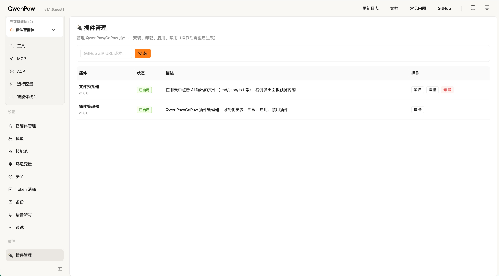

# QwenPaw 插件管理器

[](LICENSE)
[](https://github.com/longgb246/qwenpaw-plugin-manager/actions/workflows/ci.yml)
[](https://github.com/longgb246/qwenpaw-plugin-manager)
[](https://github.com/agentscope-ai/QwenPaw)

[QwenPaw](https://github.com/agentscope-ai/QwenPaw)（原 CoPaw）的可视化插件管理界面。

> **⚠️ 声明**：本项目为**非官方**的社区维护插件，与 QwenPaw / agentscope-ai 官方团队**无关**，未获得官方认可或支持。请自行评估后使用。

在 QwenPaw Console 侧边栏中直接安装、卸载、启用、禁用插件。

## 功能特性

- **可视化管理** — 在 QwenPaw Console 侧边栏显示插件管理页面
- **安装插件** — 支持从 GitHub ZIP URL 或本地路径安装
- **卸载插件** — 带确认对话框，自动清理配置和 PROFILE.md
- **启用/禁用** — 无需删除即可切换插件状态
- **插件详情** — 查看元数据、文件列表、入口点、启用状态
- **自动检测配置目录** — 同时兼容 `.copaw`（旧版）和 `.qwenpaw`（新版）
- **配置备份** — 修改 `config.json` 前自动备份

## 截图



## 环境要求

- [QwenPaw](https://github.com/agentscope-ai/QwenPaw) >= 1.1.0（需支持动态插件系统）
- Python 3.10+

## 安装

### 一键安装（推荐）

```bash
git clone https://github.com/longgb246/qwenpaw-plugin-manager.git
cd qwenpaw-plugin-manager
bash install.sh
```

### 通过 QwenPaw CLI 安装

```bash
qwenpaw plugin install /path/to/qwenpaw-plugin-manager
```

### 手动安装

```bash
# 检测配置目录
CONFIG_DIR="$HOME/.copaw"
[ ! -d "$CONFIG_DIR" ] && CONFIG_DIR="$HOME/.qwenpaw"

# 复制插件文件
mkdir -p "$CONFIG_DIR/plugins/plugin-manager"
cp plugin.json src/plugin.py src/frontend.js src/__init__.py "$CONFIG_DIR/plugins/plugin-manager/"

# 重启 QwenPaw
qwenpaw shutdown && qwenpaw app
```

## 卸载

```bash
bash uninstall.sh
```

或通过 QwenPaw CLI：

```bash
qwenpaw plugin uninstall plugin-manager
```

## 使用方法

安装并重启 QwenPaw 后：

1. 在浏览器中打开 QwenPaw Console
2. 点击侧边栏中的 **🔌 插件管理**
3. 在插件列表中查看、安装、卸载、启用/禁用插件

### 安装新插件

在"插件管理"页面的输入框中输入：

- **GitHub ZIP URL**：如 `https://github.com/user/repo/archive/main.zip`
- **本地路径**：如 `/path/to/plugin-directory`

点击"安装"按钮即可。

### API 接口

插件在本地启动 HTTP 服务（端口 `39149`）：

| 方法 | 路径 | 说明 |
|------|------|------|
| GET | `/list` | 列出所有已安装插件 |
| GET | `/info/<id>` | 获取插件详情 |
| POST | `/install` | 安装插件（`{"source": "..."}`) |
| POST | `/uninstall` | 卸载插件（`{"plugin_id": "..."}`) |
| POST | `/toggle` | 启用/禁用插件（`{"plugin_id": "...", "enabled": true}`) |

## 开发

### 开发模式（软链接）

开发时可使用软链接，代码改动即时生效（需重启 QwenPaw 重新加载）：

```bash
make dev
```

### 项目结构

```
qwenpaw-plugin-manager/
├── src/                         # 插件核心源码
│   ├── plugin.py                # 后端：HTTP API 服务（端口 39149）
│   ├── frontend.js              # 前端：React 侧边栏组件
│   └── __init__.py              # Python 包初始化
├── docs/                        # 文档资源
│   ├── SCREENSHOTS.md           # 截图说明
│   └── plugin-manager-01.jpg    # 界面截图
├── .github/                     # GitHub 集成
│   ├── workflows/ci.yml         # CI 自动化流水线
│   ├── ISSUE_TEMPLATE/          # Issue 模板
│   └── pull_request_template.md # PR 模板
├── plugin.json                  # 插件清单（必需）
├── install.sh                   # 一键安装脚本
├── uninstall.sh                 # 一键卸载脚本
├── Makefile                     # 开发快捷命令
├── LICENSE                      # MIT 许可证
├── CHANGELOG.md                 # 版本变更日志
├── CONTRIBUTING.md              # 贡献指南
├── .editorconfig                # 编辑器配置
├── README.md                    # 英文文档
└── README_zh.md                 # 中文文档（本文件）
```

### 配置目录检测逻辑

插件遵循 QwenPaw 的配置目录优先级：

1. `QWENPAW_WORKING_DIR` 环境变量（如果设置）
2. `~/.copaw`（如果存在 — 旧版安装）
3. `~/.qwenpaw`（新版默认路径）

同时安装到两个目录的场景不存在，因为 QwenPaw 只会使用其中一个目录。安装脚本会自动检测并安装到正确的目录。

## 兼容性说明

本插件同时兼容：

- **QwenPaw**（新名称）的 `.qwenpaw` 配置目录
- **CoPaw**（旧名称）的 `.copaw` 配置目录

如果你是从 CoPaw 时代就开始使用的长期用户，不需要做任何迁移，插件会自动检测并使用 `~/.copaw` 目录。

## 许可证

[MIT](LICENSE) © longgb246
